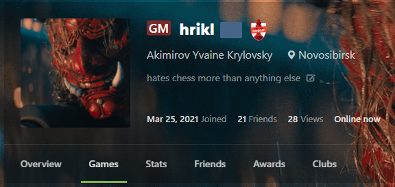
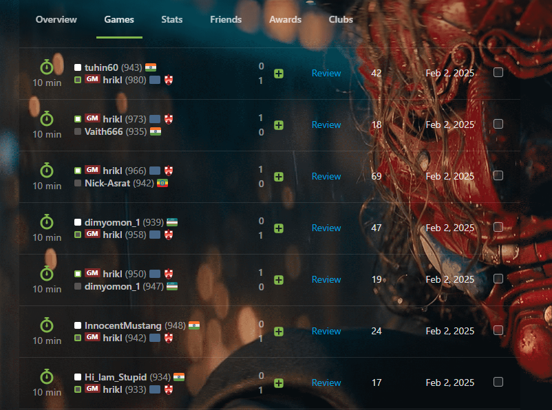
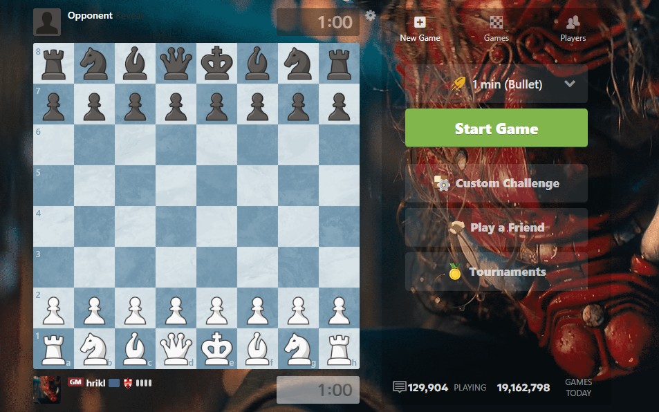

# Chess Title Badge Extension

A browser extension for customizing your Chess.com profile with various title badges. Just for fun and personal customization.

## 🚀 Version 2.0 - New Popup Interface!
**No more manual editing required!** Customize everything through an easy-to-use popup interface.

## Features
- Adds customizable title badges next to your username
- Choose from official titles (GM, IM, FM, WGM, NM, CM) or create custom titles
- Pick any color for your badge with a color picker
- Works on your profile page, game history, and live games
- Real-time preview and testing
- Settings automatically save between sessions

## Installation

### Method 1: Chrome Web Store (Coming Soon)

### Method 2: Manual Installation
1. Download the **chess-title-badge-extension** folder to your computer

2. Go to **chrome://extensions/**

3. Enable **Developer mode** (toggle in top-right)

4. Click **Load unpacked** and select the downloaded folder

5. Click the extension icon in Chrome toolbar to open the popup

6. Configure your settings:
   - Enter your Chess.com username
   - Select a title (or create custom)
   - Choose your badge color
   - Click "Save Settings"

## Customization Options

### Titles Available:
- **GM** - Grandmaster
- **IM** - International Master  
- **FM** - FIDE Master
- **WGM** - Woman Grandmaster
- **NM** - National Master
- **CM** - Candidate Master
- **Custom** - Create your own title

### Color Customization:
- Use the color picker to choose any color
- Real-time preview shows how your badge will look
- Reset to default red anytime

## Version History

### v2.0 (Current)
- 🎨 **New popup interface** - No code editing required
- 🎯 **Color picker** with real-time preview
- 📝 **Custom title support**
- 💾 **Automatic save** of settings
- 🧪 **Test feature** for instant preview

### [v1.5 (Legacy)](https://github.com/hrikl/chess-title-badge/releases/tag/v1.0)
- Required manual code editing
- Basic GM badge only

## Screenshots

### Popup Interface

### Profile Page  

### Game History

### Live Game

## Important Notes
- This extension only works locally on your browser
- It doesn't modify your actual Chess.com account or titles
- Changes are visible only to you
- Requires refresh on Chess.com pages after changing settings

## Support
For issues or feature requests, please open an issue on GitHub.
